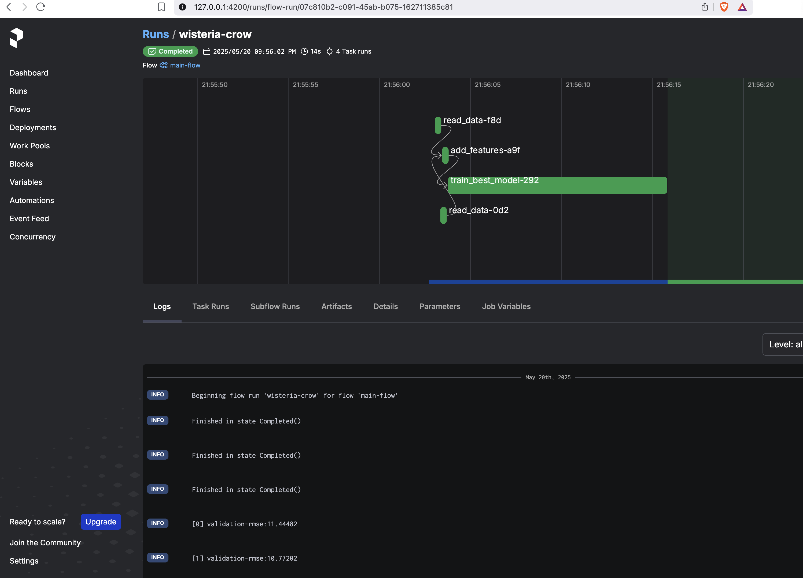
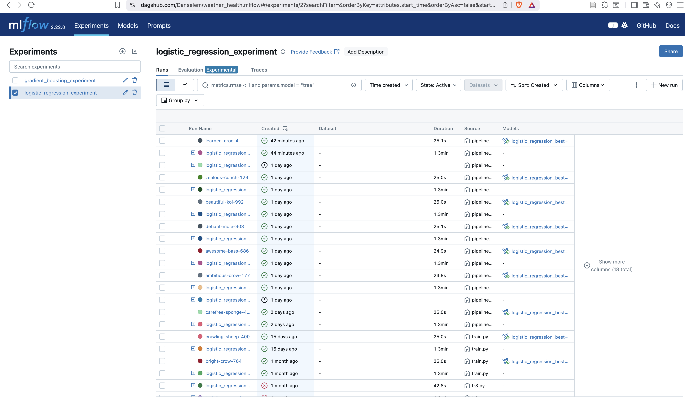
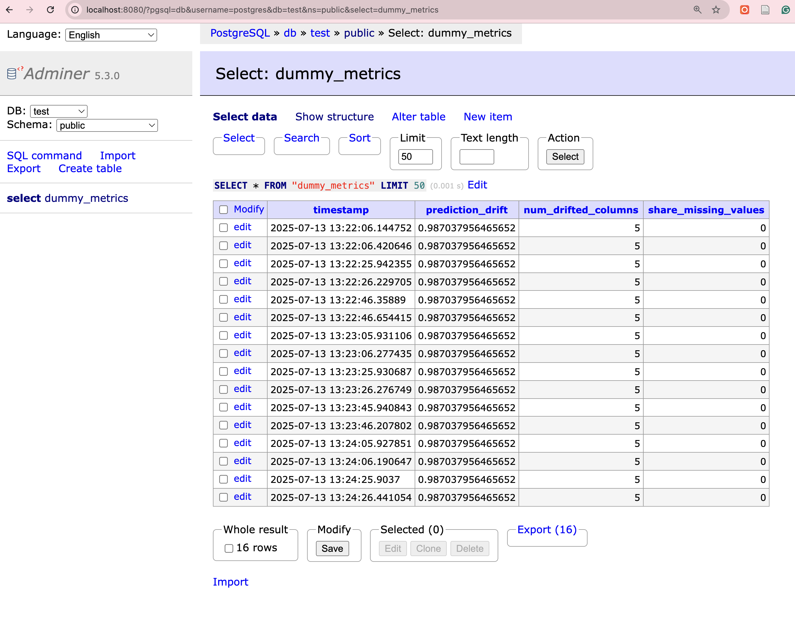
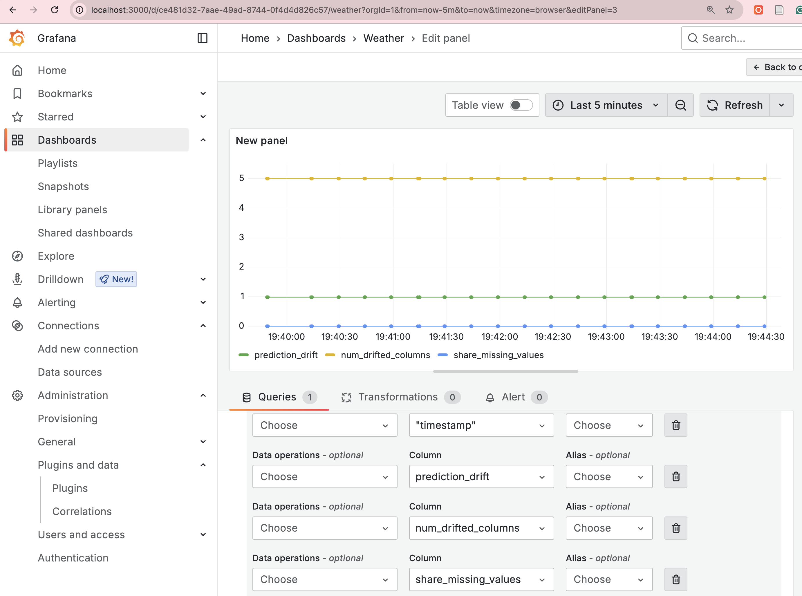

# 🌦️ Weather Disease Prediction
## 👤 Author

- **Daniel Egbo** – [@Danselem](https://github.com/Danselem)
  
## Project Description
This project aims to predict the likelihood of weather-sensitive diseases using machine learning. By analyzing historical climate and health records, it provides early warnings for disease outbreaks, empowering public health systems to respond proactively.

## 🧩 Problem Statement

Weather patterns influence the prevalence and spread of many diseases such as asthma, flu, and other respiratory conditions. The challenge is to build a robust prediction system that can:

- Accurately classify disease categories based on environmental conditions.
- Offer explainability of the predictions for healthcare stakeholders.
- Generalize well to unseen data from other regions or time periods.

## 🗃️ Dataset Overview

The dataset contains features related to weather and environmental measurements along with disease labels. Typical columns include: Age, Gender, Temperature (C), Humidity, Wind Speed (km/h), nausea, joint_pain, abdominal_pain, high_fever, chills,...,back_pain, knee_ache.

**Dataset Source:** Additional info about the data can be found on [Kaggle](https://www.kaggle.com/datasets/orvile/weather-related-disease-prediction-dataset/data).


## 🧠 Features

- End-to-end scikit-learn pipeline
- Hyperparameter optimization using Hyperopt
- Multiclass classification support
- Evaluation metrics and plots
- Feature importance for model interpretability

---

## 📊 Evaluation Outputs

| Metric     | Description                              |
|------------|------------------------------------------|
| Accuracy   | Overall correct predictions              |
| Precision  | Correctness among positive predictions   |
| Recall     | Coverage of actual positives             |
| F1-Score   | Harmonic mean of precision & recall      |


---

## ✅ Requirements

- Python 3.10+
- pandas
- scikit-learn
- matplotlib
- seaborn
- numpy
- pickle
- hyperopt 
- prefect
- evidently

## 🚀 Getting Started

### 1. Clone the repository

```bash
git clone https://github.com/Danselem/weather-health.git
cd weather-health
```

The project makes use of `Makefile` and [Astral uv](https://docs.astral.sh/uv/). Click the Astral link to see the details of the package and how to install it.

### 2. Create and activate a virtual environment
To create and activate an environment:

```bash
make init
```

### 3. Install dependencies

```bash
make install
```

### 4. Set up MLflow server

There are two options to set up MLflow

1. **Use AWS EC2 and S3**
Ensure terraform is installed on your PC and you have AWS credentials set up on your PC with `aws configure`. Next, `cd infra` then follow the instructions in [infra](infra/infra.md) for a complete set up of AWS resources including `EC2`, `RDS`, `S3`, `Kinesis`, `Lambda`, etc.

2. **Use DagsHub**
Sign up at [Dagshub](https://dagshub.com/) and obtain an API key and create a project repo. After that, run the command to create a `.env` file:

```bash
make env
```
Next, fill the `.env` file with the right information.


### 5. Start the orchestrator.
This project uses `Prefect` for running the ML pipeline. To start the prefect server, run the command:
```bash
make prefect
```
This will start a prefect server running at <https://127.0.0.1/4200>.

### 6 Run the ML Pipeline
To run the pipeline,
```bash
make pipeline
```
This will proceed to load the data, clean it, transform it and start the hyper-parameter tuning.  See image below for the prefect modeling pipeline

.

It will also log the ML experiments in Dagshub. For example, see below.
.

All experiments ran for this project can be accessed in [here](https://dagshub.com/Danselem/weather_health/experiments).

### 7. Fetch and serve the best model
```bash
fetch-best-model
```
The above command will fetch the best model from the Dagshub ML server and save it in the [models](models) repo. With this, we are ready to serve the model.

Generate sample data for testing the serve service.
```bash
make sample
```
Test the local deployment
```bash
make serve_local
```

**Test for `[docker](/Dockerfile)` deployment**

Build the docker
```bash
make build
```
Start the docker container
```bash
make run
```
Then test the serve script:
```bash
make serve
```

### 8. Monitoring
A simulated inference was performed in this project for testing observability with `Evidently`. See the [observability](/monitoring/) directory.

Start the container

```bash
start-monitoring
```
This will start a docker compose with `postgres`, `adminer` and `grafana`. 

Adminer can be accessed at <https://127.0.0.1/8080>. Grafana can be accessed at <https://127.0.0.1/3000>.

Simulate the inference with the command:

```bash
make observe
```

For example, see 






---

## 🧪 Testing

To test your setup or add unit tests:

```bash
pytest tests/
```

---

## 📌 Notes

- Label encoding is required for correct ROC/metric computation.
- Only models with `.feature_importances_` are supported for feature explanation.
- SHAP and PDP (partial dependence plots) are excluded for simplicity and clarity.

---

## 📜 License

This project is licensed under the MIT [License](/LICENSE).

---

## 🙋🏽‍♀️ Contact

Created by [Daniel Egbo](mailto:danoegbo@example.com). Feel free to reach out with questions, issues, or suggestions.
